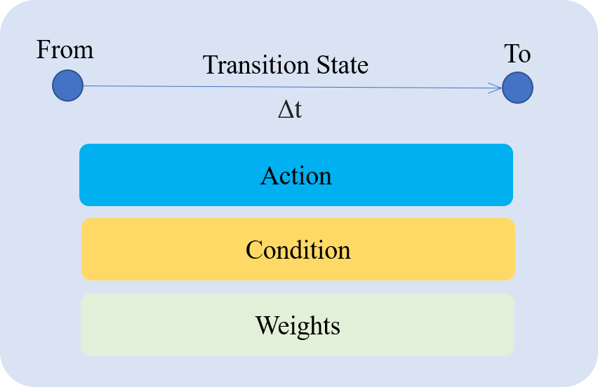
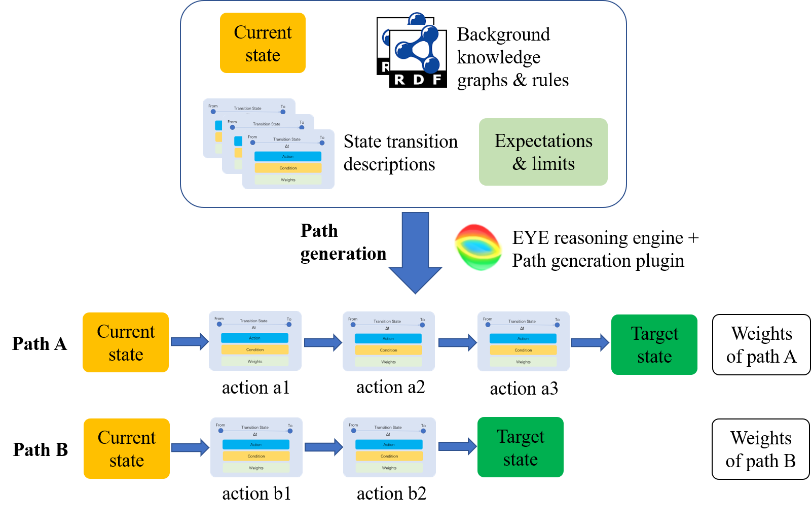

#Weighted state transition logic (wstLogic) for future state prediction 

Current adaptive systems are mostly built on detecting an event and take corresponding adaptations. 
Weighted state transition logic aims to model the future state, and allows to carry adaptive pathway management based on the predicted future state.
The weighted state transition logic is developed in the GPS4IC project to perform adaptive clinical pathway management.
Nevertheless, the application of such a logic is not limited to the clinical domain, 
but can also be extended to other domains for adaptive workflow management.

This repository provides a semantic web based implementation of the wstLogic. 
Sample scenarios of using wstLogic for adaptive clinical pathway management to cope with comorbidity is also provided.

##Basic concept of weighted 
 
 

 
 

The basic concept of wstLogic is inspired from [linear logic](https://girard.perso.math.cnrs.fr/Synsem.pdf) that during a state transition,
the expired state (represented as 'From') can be retracted, 
and the new state (represented as 'To') can be asserted. 
The wstLogic extends the linear logic to include weights, 
conditions and transition state during state transition

##A semantic web based implementation
The wstLogic is implemented with semantic representation as backward rules 
in N3 language. 
A set of ontology named as [gps-schema](http://josd.github.io/eye/reasoning/gps/gps-schema) 
is created to enable a semantic representation of state change. 
The current state of a patient is represented with RDF graphs, 
and the target to reach is represented as an N3 query. 
Background knowledge is also introduced as RDF graphs or N3 rules. 
A semantic reasoning engine ([EYE](https://github.com/josd/eye)) is used 
to execute a set of tasks for adaptive pathway management.

##Path generation
 
 

 
 

Once the state transitions and background knowledge of a relevant domain are set up, 
it is possible to automatically generate a set of potential paths from 
the current state of a patient towards a target state. 
The EYE reasoning engine takes the current state of the patient, 
together with background knowledge and state transition descriptions 
of the relevant domain as inputs of a reasoning process for path generation.
This path search approach is largely inspired by the [RESTdesc](https://arxiv.org/pdf/1512.07780.pdf), 
with the improvement to make use of wstLogic for state transition description, 
as well as some refinements in the path search process.

The path generation process is executed by the EYE reasoning engine with the 
[path generation plugin](https://github.com/hongsun502/wstLogic/blob/master/engine/gps-plugin.n3)

##Other functions
The implementation made in this repository is also able to support the following functions:

**Path aggregation**
Path aggregation aggregates the actions listed in different paths, and sort them with temporal orders.

**Path validation**
Path validation checks whether executing a planned path would lead to the defined goal following the update of patient state. 

**Conflict detection**
Conflict detection checks if a new path brings any conflict with existing paths.
It checks two types of conflicts: 
Firstly, it checks if there are any explicit conflicts between different operations.

Secondly, it checks implicit conflicts by checking if both the existing target 
and the new target can be reached by applying the aggregated path sequentially.

These functions are all executed by the EYE reasoning engine with [a set of plugins developed in this repository](https://github.com/hongsun502/wstLogic/tree/master/engine)

##Structure of this repository
###Implementation of wstLogic
**/engine**

This folder contains a set of rules and plugins that implement the wstLogic with semantic web language.

###Scenario of adaptive clinical pathway management (A demonstration for [GPS4IC project](https://www.imec-int.com/en/what-we-offer/research-portfolio/gps4integratedcare))
**/data**

This folder contains different sample data to represent different states 
of a patient in the demonstration.

**/colon-cancer and /parkinson**

These two folders are about two application domains of the demonstration. 
Each contains relevant state transitions, as well as goals, and domain relevant background knowledge.

**/knowledge**

This folder contains background knowledge that is independent of the colon cancer and Parkinson domain. 
E.g. stating conflicts between actions.

**/path**

This folder stores different types of paths generated in the demonstration.

**/notebooks**

This folder uses jupyter notebooks as the interface to demonstrate 
the adaptive clinical pathway management with the wstLogic.
It contains three jupyter notebooks to display the data, 
execute the pathway management, and visualize the output.

##How to run the demonstration
Download/clone this github project, 
install the EYE reasoning engine following the [install instruction](https://github.com/josd/eye/blob/master/INSTALL), 
enter the /notebook folder to run the notebooks for the demonstration.

##Publications
Predicting future state for adaptive clinical pathway management, 
in submission to Journal of Biomedical Informatics

##Contact information
Hong Sun (hongsun502@gmail.com)
